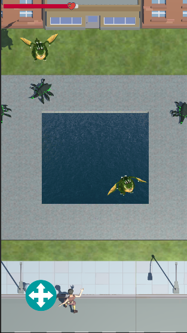
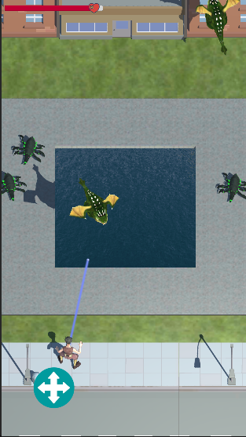
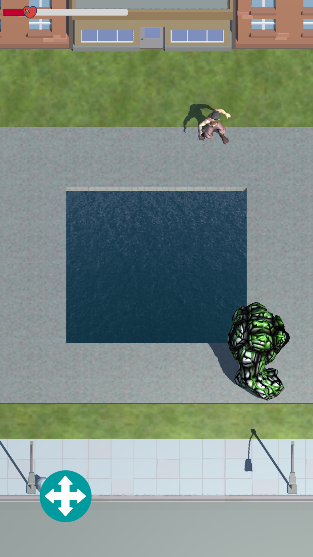

# Arcade Game Prototype
Arcade Game Prototype - You play for the dwarf. The dwarf can shoot with some intervals only when he doesn't move. There are two levels in this game. The location of both levels is a backyard with a pool. 
The player should kill 5 enemies on the first level. There are two types of enemies:

<ul>
  <li>Spider - just follows the player and set damage. Can't go through the pool.</li>
  <li>Dragon - Flies in the sky over the swimming pool. Moves to random points. Shoots player by fireballs.</li>
</ul>

On the last level level player should kill the Golem Boss. This enemy has 3 different states, that are switched randomly:
<ul>
  <li>QueueAttack  - starts queue of attack with interval of 200 ms, then move to random point.</li>
  <li>RushMove - moves with double speed and apply damage to player when colliding. Makes earthquake camera effect.</li>
  <li>Сannonade - Shoot 3 times, one to player direction and 2 others in right and left direction of 30 degrees from first.</li>
</ul>

Also game designer can edit characteristics of enemies and player in json file.
